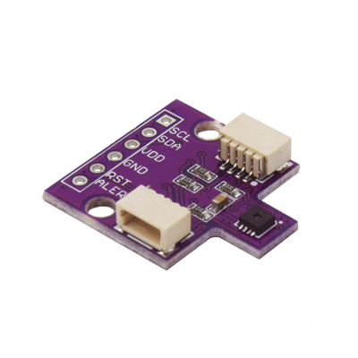

# Zio Qwiic SHT31 Temperature Humidity Sensor

> This product can be available for purchase [here](https://www.smart-prototyping.com/Zio-Qwiic-Temperature-Humidity-Sensor-SHT31).

#### Description

The SHT31 digital temperature and humidity board takes sensor technology to a new level! This board is fully calibrated and as the rest of Sensirion products, the SHT31 integrates CMOSens® technology which combines both sensors on a single silicon chip. Providing high precision data in a cost efficiency chip! 

Most of STH sensors don’t provide a true I2C interface for easy reading, but we got good news, this sensor provides multiple functions and interfaces, including I2C with two address options. Do we need to give you more reasons why we have incorporate it to our Qwiic family ecosystem :) ? In a few words this one sensor earned to be part of family for its high precision and simplicity to use.  

Let's get into some cool details! Talking about precision, it has a ±2% error on relative humidity. For the temperature measurements it is not lagging behind, with a ±0.3 °C accuracy even on extreme conditions, from -40 to 125 °C.

Just in case you would like to use this board without the Qwiic connector, we have incorporated header pins. As well as if you’d like to access the ALERT and RESET pins.

#### Specification

* Supply Voltage: 3.3V
* Accuracy
  * Relative Humidity: ±2%
  * Temperature: ±0.3 °C
* Interface: I2C (selectable address at 0x44 (default) and 0x45)
* Dimensions: 16.5 x 25.3mm
* Weight: 1.1g

#### Links

* [SHT31 Datasheet](https://www.sensirion.com/fileadmin/user_upload/customers/sensirion/Dokumente/0_Datasheets/Humidity/Sensirion_Humidity_Sensors_SHT3x_Datasheet_digital.pdf)
* [Eagle File and Schematic](https://github.com/ZIOCC/Zio-Qwiic-SHT31-Temperature-Humidity-Sensor)
* [SHT31 Library](https://github.com/adafruit/Adafruit_SHT31)

> ###### About Zio
> Zio is a new line of open sourced, compact, and grid layout boards, fully integrated for Arduino and Qwiic ecosystem. Designed ideally for wearables, robotics, small-space limitations or other on the go projects. Check out other awesome Zio products [here](https://www.smart-prototyping.com/Zio).
